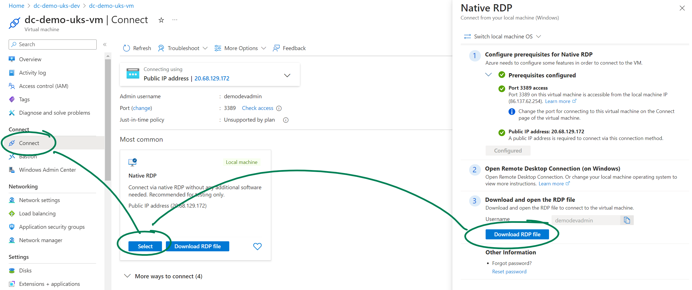
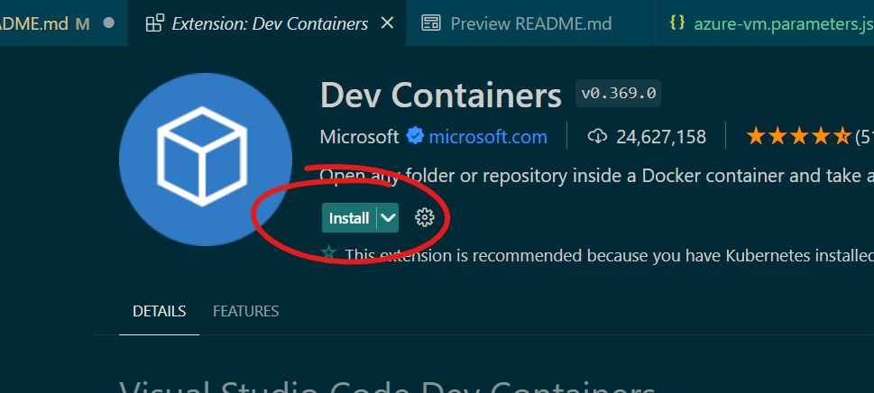

# Bicep 101

Getting started with [Azure Bicep](https://learn.microsoft.com/en-us/azure/azure-resource-manager/bicep/).

This repo will walk you through installing and setting everything up to play around with bicep files and deployments.
It will also cover some of my opinionated best-practises for creating bicep files.

## 000-vm
This folder contains a bicep file configured to deploy a Windows VM and all the necessary extras to have a working, publicly accessible VM for experimentation. I included this because my setup already has software and settings configured, and this VM gives a clean slate to demonstrate everything. It is not needed for the rest of the demo.

It is included here to:
1. Give a clean platform to practise installing the tools required for BICEP, and
2. To give a demonstration of bicep best practises.

### Steps
1. In [./000-vm/azure-vm.parameters.json](./000-vm/azure-vm.parameters.json) add a secure password to the `adminPassword` parameter. Best practise is to use SSH, but that complicates this demo! Also add an organisation code. I usually use my initials, `dc`.
2. Deploy. How? Follow the demo below to find out!

## 001-connect
Now we have our VM, we need to connect to it. I recommend RDP for windows VMs, as we're all used to working with a user-interface.

### Steps
1. Navigate to your newly deployed VM in the Azure Portal.
2. On the left menu, select `Connect`, and choose `Native RDP`.
3. Download the RDP file, and take a note of the admin username

4. Run the RDP file, and use the admin username and password from [000-vm's steps](#steps).
5. If asked about certificates, accept the certificate by choosing `Ok`.

## 100-install
Here we'll gather all the tools we need to create and deploy BICEP files.

We will need:
- Git (for this repo!)
- VSCode
- VSCode's Bicep extension
- VSCode's Azure Account extension

### Steps
1. Download and install git if you don't have it.
2. Download and install VSCode from [https://code.visualstudio.com/](https://code.visualstudio.com/).
3. Open VSCode.
4. Open the `Extensions` pane, by clicking here:

> Note: your bar might look different. I have a lot of extensions already installed!

5. Using the search bar at the top, search for and install `Azure Account` and `Bicep`. You install by clicking here for each extension:

6. Clone this repo from github, and open it in VS Code.

## 200-deploy-resource-group
Now everything is configured, we can test our setup with a simple deployment.
Open [./200-deploy-resource-group/main.bicep](./200-deploy-resource-group/main.bicep) in VSCode, and then hit `CTRL+SHIFT+P`

> `Ctrl+Shift+P`
> This shortcut opens the Command Palette in VS Code. You can use it to perform most actions in VS Code, it is super useful!

1. Search for `Bicep: Deploy Bicep File...`, and select it
2. Log in using the Azure Account option. It will open a new page, where you need to log in with your Azure account.
3. Choose a subscription. Your personal MPN (if you have one) is best.
> Note: don't choose a client subscription!
4. Follow the rest of the prompts.
5. The terminal should open and say "View deployment in portal:". Click the link to view your deployment progress!

## 300-deploy-storage-account
This demo shows how to create child-resources by referencing the parent.
We create a Storage Account, then inside that we create a Blob Service (something we don't have to do in the Azure Portal!), then inside the Blob Service we finally create a Container.

Exercise:
- Parameterise the Storage SKU, so we can choose Standard_GRS instead of the hard-coded Standard_LRS
- Create another container alongside the one we've called 'data-lake'. Call it 'landing-lake'

- Create a file share. You will first need to create a File Service, then a File Share.
> Note: the services (Blob Service and File Service) must be called 'default'.

## 400-deploy-sql-db
Here we're deploying multiple databases to a sql server automatically.

Exercise:
- The resources are deployed, but we can't access them. Create a FirewallRule resource to allow your IP address.
- Change the scale only for the database `demo1`.

## 500-broken-bicep
Here I've created a bicep file but it's broken. How do we iteratively troubleshoot and fix it?

Exercise:
- Successfully deploy the bicep file. You will need to fix various errors, and use the `Output` window in VS Code to troubleshoot.